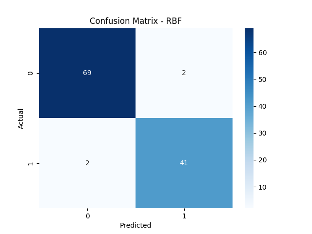
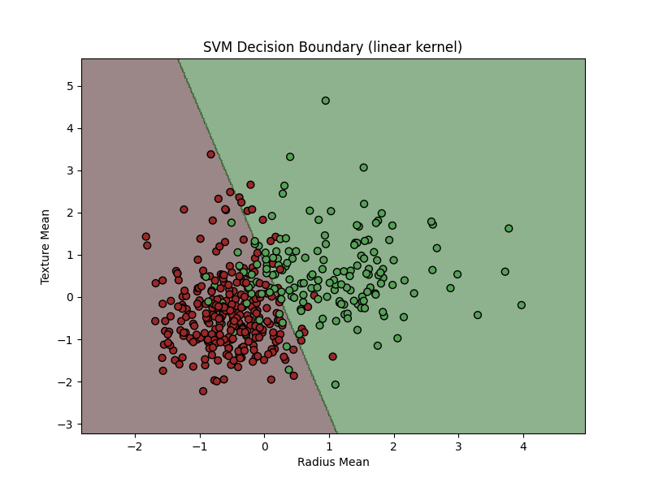
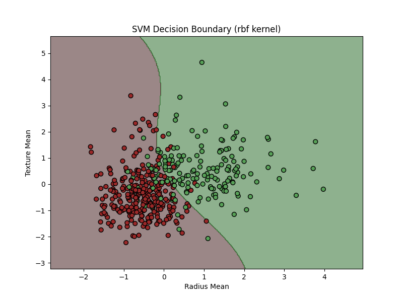

# Task 7: Support Vector Machine (SVM) Classification

## 🧩 Overview

This project demonstrates binary classification using **Support Vector Machines (SVM)** on the **Breast Cancer Dataset**. The goal is to distinguish between **malignant (M)** and **benign (B)** tumors using both **Linear** and **RBF** kernels.

The project covers data preprocessing, model training, evaluation, and visualization of decision boundaries.

---

## 📊 Dataset Information

The dataset contains **30 numerical features** derived from images of breast masses.

| Feature Category                           | Description                                                   |
| ------------------------------------------ | ------------------------------------------------------------- |
| `id`                                       | Identifier (removed before training)                          |
| `diagnosis`                                | Target variable — M = Malignant, B = Benign                   |
| `radius_mean` to `fractal_dimension_worst` | Statistical measurements (mean, standard error, worst values) |

The dataset is widely used for machine learning classification tasks.

---

## 📁 Folder Structure

```
SVM__AI-ML/
│
├── data/
│   └── breast-cancer.csv                     
├── notebooks/
│   └── SVM_Classification.ipynb     # Optional notebook for experimentation and testing
│
├── src/
│   ├── data_loader.py               
│   ├── model.py                     
│   ├── evaluate.py                  
│   └── utils.py                     
│
├── outputs/
│   ├── svm_linear_boundary.png     
│   ├── svm_rbf_boundary.png         
│   ├── confusion_matrix_Linear.png  
│   ├── confusion_matrix_RBF.png     
│   └── report.txt                   
│
├── requirements.txt                 
└── main.py                          
```

---

## ⚙️ Setup Instructions

### **1️⃣ Clone the repository**

```bash
git clone https://github.com/Mamoonkhan11/SVM__AI-ML
cd SVM__AI-ML
```

### **2️⃣ Create a virtual environment**

```bash
python -m venv .venv
# Activate it
# Windows
dotvenv\Scripts\activate
# macOS/Linux
source .venv/bin/activate
```

### **3️⃣ Install dependencies**

```bash
pip install -r requirements.txt
```

---

## 🚀 Usage

### **Run the complete pipeline**

```bash
python main.py
```

This script:

1. Loads and scales the dataset.
2. Trains both **Linear** and **RBF** kernel SVM models.
3. Evaluates accuracy, precision, recall, and F1-score.
4. Saves confusion matrices and decision boundary plots in `outputs/`.

---

## 📈 Visualizations

**Confusion Matrix (Linear SVM):**


**Confusion Matrix (RBF SVM):**



**Decision Boundary (Linear):**



**Decision Boundary (RBF):**



---

## 🧠 Key Learnings

* Handling categorical targets (`M` and `B`) using label mapping.
* Feature scaling for SVM convergence.
* Comparison of **Linear** vs **Non-linear (RBF)** kernels.
* Plotting 2D decision boundaries using first two features.

---

## 🧾 Requirements

```
pandas
numpy
scikit-learn
matplotlib
seaborn
```

Install with:

```bash
pip install -r requirements.txt
```

---